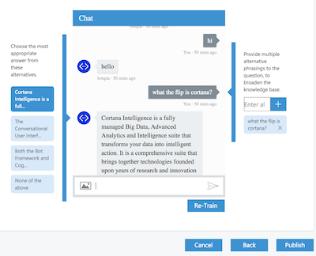

# QnA Maker - Minimal Bot example

The [QnA Maker](http://qnamaker.botframework.com) is a great service currently under active development at Microsoft that automates the publishing of FAQ-style content in a manner that makes it easy to consume from a Bot or conversational type interface.



You just feed it a simple structured document containing question and answers pairs or even just 
point to a URL that hosts your existing FAQ content and out pops a URL endpoint that you can pass 
natural language queries to. Like this:

  http://qnaservice.cloudapp.net/KBService.svc/GetAnswer?kbId=a3dae93561d24529b11a4c0eb8acd444&question=What%20is%20cortana

It also exposes the ability to tweak the model by training. If you ask a question and get an 
unexpected answer you can head back into the admin pages to edit the model, show it which answer 
you wanted it to return for any particular question and then retrain and republish the udpated 
model. It's easy to imagine (but not demonstrated here) a scheme where questions people are 
not getting answers to are flagged in the logs and periodically used to retrain better and better 
models.

It's a pretty powerful service, I think, and addresses one of the most common use cases for Bot 
interfaces which is the automated servicing of the most commonly asked questions to customer 
helpdesks.

## Calling from a Bot interface

Couldn't be easier really:

  ``` javascript

  request(config.get('qnaUri') + q, function (error, response, body) {
    session.send(response.answer); 
  });
  ```

Of course we can get as complex as we like here, adding metadata to the answer for instance to influence whether we show [Cards](https://docs.botframework.com/en-us/node/builder/chat-reference/classes/_botbuilder_d_.herocard.html) or other fancy stuff.

### Setting up your new Bot

For the purposes of this demo I've pre-trained a QnA Maker service on the existing 
[Bot Framework FAQ](https://docs.botframework.com/en-us/faq/) but of course you can use any
FAQ-style content you want. Just rememember the change the qnaUri setting in localConfig.json 
to point your own endpoint.

 - Clone this repo, natch!!
 - Create a [new bot](https://dev.botframework.com/bots/new). Make sure you copy the app password as this is the /only/ time you'll get to see it.
 - Copy and paste the App Password and Microsoft App Id into ./localConfig.json at the appropriate places
 - Deploy your bot to a publicly accesible URI (or use a tool like [ngrok](https://ngrok.com/) to
make your dev machine publicly available) 
  - Configure the bot's Messaging Endpoint with that URI. 
    Use the 'Test' button on the bot config page to check this is all working. If you see 'Accepted' come back as the response then all is working.
 - Add your bot to Skype using the button available in the Channels section of the bot's config page
 - Start the bot: 
```bash
bash$ node app.js 
```

And that's it.. you should now be able to ask the Bot in your Skype chat anything you like about the Microsoft Bot Framework.

## Channel Transfer ??

Out of the box you get 2 channels set up without any messing around every time you set up a new bot. Skype and the WebChat. With a little more messing around you can get a whole bunch more. 

What you'll soon start to figure out though is that identities aren't magically linked in any way. That's not a fault of the Bot Framework, it's just a normal consequence of a user's expectation of privacy. If this is a problem for your application you'll have to persuade the user to help you link their ids together, possibly adding a mapping to your own app's concept of id along the way. 

A simple way of doing this is to just generate some unique token identifier for the user that if pasted into some other channel allows you to link the two identities (I wouldn't recommend using a user id directly as that could constitute a security risk). Not super elegant but it works. Perhaps we'll see better solutions the bots become more mainstream and users expect context to follow them around more.
